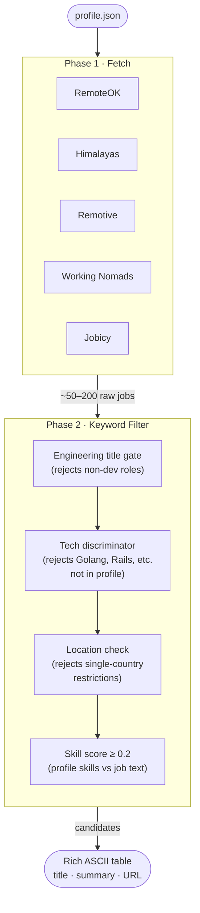

# LinkedWhisper

Remote job matcher. You give it your profile; it searches multiple job boards, applies a multi-layer filter, and prints a table of relevant engineering roles.

## Pipeline



## What it does

1. **Generates your profile** from a plain-text resume using Claude. Extracts skills, preferred roles, salary floor, and keywords to exclude.
2. **Searches job boards** across five sources: RemoteOK, Himalayas, Remotive, Working Nomads, and Jobicy. Each connector uses your profile skills to drive API-level tag/search filtering where supported.
3. **Filters by keyword** — a multi-layer pre-pass that drops:
   - Titles that don't look like engineering roles (no "engineer", "developer", "architect", etc.)
   - Titles that name a primary tech stack not in your profile (Golang, Rust, Flutter, Rails, PHP, …)
   - Jobs with a single-country location restriction when your profile requests remote work
   - Jobs that don't match any of your skills or preferred roles (score < 0.2)
4. **Prints a table** — surviving candidates are printed as a rich ASCII table with title, company, description summary, and URL.

## What to expect

- Typical run: 100–200 raw postings → multi-layer filter drops ~85–90% → 10–20 relevant candidates printed.
- No LLM calls during filtering — fast and free to run repeatedly.
- `ANTHROPIC_API_KEY` is only needed for `generate-schema`.

## Setup

**Prerequisites:** Python 3.11+, [Poetry](https://python-poetry.org/docs/#installation)

```bash
# Install dependencies
poetry install

# Copy and fill in your API key (only needed for generate-schema)
cp .env.example .env
# Edit .env — set ANTHROPIC_API_KEY=sk-ant-...
```

## Usage

### 1. Generate your profile schema

Point it at a plain-text resume file:

```bash
poetry run linked-whisper generate-schema --resume resume.txt
# → Writes profile.json in the current directory
```

Review `profile.json` and tweak before running the search:
- **`excluded_keywords`** — add role types or tech you don't want (e.g. `"QA engineer"`, `"blockchain"`)
- **`preferred_roles`** — the seniority/role titles you're targeting
- **`work_type`** — include `"remote"` to enable location filtering

### 2. Search and filter jobs

```bash
poetry run linked-whisper run --profile profile.json
```

To limit to specific connectors:

```bash
poetry run linked-whisper run --profile profile.json --connectors remoteok,himalayas
```

Output is a table printed to the terminal — copy URLs directly from it.

## Keyword filter in detail

The filter runs four checks in order; any failure scores the job 0 and drops it:

| Check | What it rejects |
|---|---|
| Engineering title gate | "Office Assistant", "Sales Rep", "Content Writer" — anything without an engineering role word |
| Tech discriminator | Titles naming a primary stack not in your `skills` (Golang, Rust, Flutter, Rails, PHP, WordPress, …) |
| Location compatibility | Single-country postings ("USA", "Brazil", "Germany") when `work_type` includes `"remote"` |
| Skill score | Jobs where none of your skills or preferred roles appear in the title, tags, or first 500 chars of description |

Multi-region locations ("Americas, Europe, Israel") pass through — they're broad enough to be worth reading.

## Configuration

All settings live in `.env` (copy from `.env.example`):

| Variable | Default | Description |
|---|---|---|
| `ANTHROPIC_API_KEY` | — | Required for `generate-schema` only. |
| `KEYWORD_FILTER_THRESHOLD` | `0.2` | Minimum skill score to pass the filter. Lower = more results. |

## Job board connectors

| Source | API filtering used |
|---|---|
| RemoteOK | Fetches all, slices to limit |
| Himalayas | `?q=<top skills>&limit=N` |
| Remotive | `?category=software-dev&search=<top skills>&limit=N` |
| Working Nomads | Post-fetch dev-category filter |
| Jobicy | `?tag=<primary skill>&count=N` |
